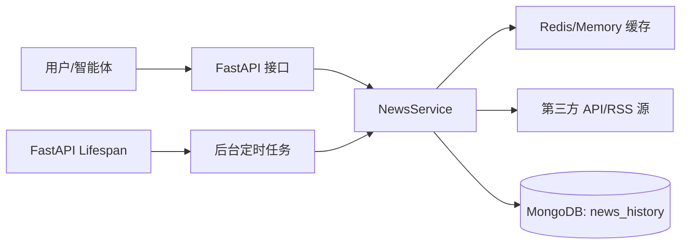

# 财经新闻服务 (News Service) 架构与实现文档

本文档详细介绍了 `trading-data-service` 中财经新闻模块的设计思路、采集流程、持久化方案及运维细节。

---

## 1. 核心架构设计

新闻模块采用 **“实时爬取 + 后台定时采集 + 持久化存储”** 的混合模式，旨在解决新闻数据的时效性与历史追溯能力的平衡问题。

### 1.1 数据流向


---

## 2. 数据采集 (Data Acquisition)

支持多个主流财经媒体源，针对不同源采用差异化爬取策略：

| 来源 | ID | 技术手段 | 更新频率 | 特点 |
| :--- | :--- | :--- | :--- | :--- |
| **新浪财经** | `sina` | AKShare (Global Sina) | 实时 / 10min | 国内最全行情快讯 |
| **财联社** | `cls_hot` | AKShare (Global CLS) | 实时 / 10min | 热门快讯，A 股敏感度高 |
| **华尔街见闻** | `wallstreetcn` | API (JSON) | 实时 / 10min | 全球视野，深度内容 |
| **雅虎财经** | `yahoo_rss` | RSS (XML) | 实时 | 国际宏观新闻 (需 UA 伪装) |

### 2.1 技术细节：
*   **解析适配器**：针对华尔街见闻等动态 API，程序会自动从 `resource` 节点提取 `content_short` 摘要。
*   **反爬伪装**：所有爬虫均集成了 `User-Agent` 伪装，避免触发 429 访问限制。
*   **并发控制**：采集任务运行于异步线程池 (`to_thread`)，不阻塞主服务 loop。

---

## 3. 持久化与去重 (Persistence & Deduplication)

### 3.1 数据库结构
新闻数据存储在 MongoDB 的 `news_history` 集合中。
*   **集合名称**: `news_history`
*   **去重字段**: `url` (唯一键)
*   **核心字段**: `source`, `title`, `content`, `published_at`, `url`

### 3.2 自动索引
系统在首次启动或存储时会自动创建以下索引：
*   `url`: 唯一索引，确保海量抓取时不产生重复记录。
*   `published_at`: 降序索引，优化按时间排序和范围过滤的性能。

### 3.3 存储逻辑 (Upsert)
采用 `update_one(..., upsert=True)` 模式。如果检测到同一 URL 的新闻内容发生小幅修正，系统会更新现有条目而非创建新条目。

---

## 4. 后台任务 (Background Tasks)

### 4.1 任务逻辑
在 `main.py` 的 `lifespan` 钩子中启动：
*   **初次触发**: 服务启动后立即执行第一次全量抓取。
*   **定时周期**: 每 **10 分钟** 执行一次，覆盖所有配置的 `_SUPPORTED_SOURCES`。
*   **自动恢复**: 如果单次抓取因网络超时失败，任务会记录日志并在下一周期自动重试。

---

## 5. 调试与排查

### 5.1 响应状态码对照
*   **200 OK**: 成功获取数据。
*   **Empty Result (`[]`)**:
    1.  **时间过滤**: 设定的 `start_datetime` 过早，而本地库或实时源尚未覆盖该时间段。
    2.  **网络异常**: 对应源 API 无法访问（如 `yahoo_rss` 触发 429）。
*   **401 Unauthorized**: 未启用免登录或未传正确的 API Key。

### 5.2 查看日志
可以通过以下命令查看到后台任务的运行状态：
```bash
# 例子输出
2026-02-28 11:20:45 [INFO] data_service.main: 📡 启动新闻定时爬取任务...
2026-02-28 11:20:47 [INFO] data_service.services.news_service: 已持久化 42 条新闻到数据库
```

---

## 6. 后续演进方向
1.  **全文检索**: 计划引入 MongoDB 的 Text Index，支持新闻标题与关键词搜索。
2.  **AI 摘要**: 对接 LLM 层（Analysis Layer）对抓取的新闻进行热点提炼和利好/利空情绪分析。
3.  **增量同步优化**: 仅对高频变动的源（如 `sina`）缩短爬取间隔至 1 分钟。
